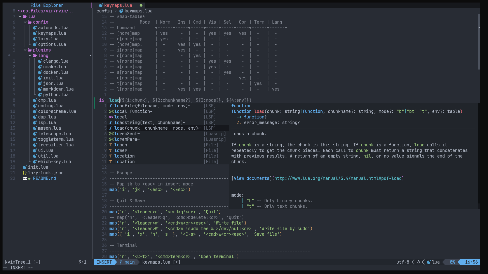

# Neovim

Config nvim by [lazy.nvim]

Reference [NeovimZero2Hero] | [从零配置 Neovim] | [Neovim IDE from Scratch] | [LazyVim]

[lazy.nvim]: https://github.com/folke/lazy.nvim
[NeovimZero2Hero]: https://www.bilibili.com/video/BV1VP411y75a/
[从零配置 Neovim]: https://www.bilibili.com/video/BV1hP41117rt/
[Neovim IDE from Scratch]: https://www.youtube.com/watch?v=ctH-a-1eUME&list=PLhoH5vyxr6Qq41NFL4GvhFp-WLd5xzIzZ&index=1&t=3s
[LazyVim]: https://github.com/LazyVim/LazyVim
