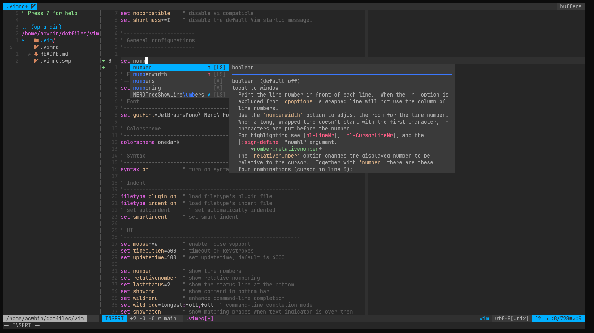

# Vim

Config vim by [vim-plug]

Reference [anishathalye] | [JJGO]



## Colorscheme

```sh
# https://github.com/joshdick/onedark.vim?tab=readme-ov-file#installation
cp ~/.vim/plugged/onedark.vim/colors/onedark.vim ~/.vim/colors/onedark.vim
cp ~/.vim/plugged/onedark.vim/autoload/onedark.vim ~/.vim/autoload/onedark.vim
```

## Coc

在 Windows 的 git-bash 中运行，coc.nvim 会出现如下错误

```txt
2024-04-03T15:13:40.166 ERROR (pid:11320) [node-client] - request error on "nvim_call_function" [ 'pyxeval', [ '1' ] ] Error: request error on "nvim_call_function" - Vim(return):E370: Could not load library msys-python3.11.dll: No such file or directory on api "call_function" ["pyxeval",["1"]]
```

解决办法：

1. [vim python](https://blog.csdn.net/fangkailove/article/details/107039505)
2. `rm ~/AppData/Local/coc -rf` 后重新打开 vim

[vim-plug]: https://github.com/junegunn/vim-plug
[anishathalye]: https://github.com/anishathalye/dotfiles/blob/master/vimrc
[JJGO]: https://github.com/JJGO/dotfiles/blob/master/vim/.vimrc
